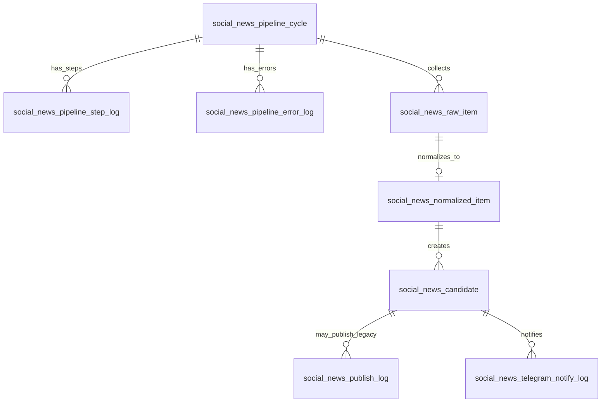

# 02_SOCIAL_NEWS_CURRENT.md

```md
# Social News Current DB Reference

## 1. Purpose

The `social_news` schema stores news collection and candidate evaluation data.

Its current role is to support:

- news collection
- raw source preservation
- normalization
- candidate scoring
- duplicate detection
- pipeline cycle logging
- publish/notify tracking if still present

The intended long-term role is source news management, not final content publishing.

## 2. Current Scope

The social news domain starts from external news sources and ends at a news candidate.

Current logical flow:

```text
collector
→ raw_item
→ normalized_item
→ candidate
→ duplicate / skipped / ready
````

If publishing still happens directly from this schema, that path should be treated as legacy or transition-state behavior.

## 3. Key Tables

### 3.1 pipeline_cycle

Purpose:

Stores one news automation execution cycle.

Typical data:

* cycle key
* keyword
* trigger source
* dry-run/real mode
* started/ended time
* collected count
* selected count
* error summary

Used by:

* dashboard summary
* operation logs
* cycle-level troubleshooting

### 3.2 pipeline_step_log

Purpose:

Stores step-level execution result inside a cycle.

Typical steps:

* collect
* normalize
* summarize
* duplicate check
* evaluate
* select
* publish
* notify

Important distinction:

A skipped disabled step is not the same as a failed step.

### 3.3 pipeline_error_log

Purpose:

Stores exception/error details for a cycle or step.

This table should preserve:

* error code
* error message
* context
* stack trace if needed

UI should show safe summary first, not raw stack trace by default.

### 3.4 raw_item

Purpose:

Stores raw news items collected from external sources.

Expected fields:

* source type
* source URL
* original URL if available
* raw title
* raw summary
* raw content
* source name
* search keyword
* language
* collected at
* raw payload

Rule:

Raw item is evidence.
It should not be overwritten with generated content.

### 3.5 normalized_item

Purpose:

Stores normalized news item generated from raw item.

Expected fields:

* canonical URL
* clean title
* clean summary
* clean content
* language
* category
* hash key
* title hash
* similarity key

Rule:

Normalized item is still source data, not final post content.

### 3.6 candidate

Purpose:

Stores news candidate used for scoring, duplicate judgment, and possible promotion to content candidate.

Expected fields:

* normalized item reference
* title
* source URL
* canonical URL
* summary/content
* category
* keyword
* score fields
* duplicate risk
* Korea relevance
* foreign worker relevance
* status
* publish status if present
* generated summary fields if present

Rule:

`social_news.candidate` should represent a source news candidate.

It should not be treated as the final Facebook content object.

### 3.7 publish_log

Purpose:

Stores publish result if the older direct social news publishing path is still active.

Architecture warning:

If `content.publish_log` also exists, this table may be transitional or legacy.

The authoritative publishing log should eventually belong to `content`.

### 3.8 telegram_notify_log

Purpose:

Stores Telegram operation notification result.

Telegram is not an approval interface.

It should record:

* published/skipped/failed notification
* error message
* related candidate
* dry-run or real mode

## 4. Current Status Values to Check

Expected or observed status values may include:

```text
CANDIDATE
NORMALIZED
SUMMARIZED
DUPLICATE
SKIPPED
READY_TO_PUBLISH
DRY_RUN_PUBLISHED
PUBLISHED
FAILED
DRY_RUN_NOTIFIED
NOTIFIED
POST_EXPIRED
FAILED_PERMISSION
FAILED_REPOST_REQUIRED
```

Action:

Status values must be inventoried from the real DB.

Status values should be documented as:

* source processing status
* publish status
* error status
* lifecycle status

They should not all be mixed into a single ambiguous state machine.

## 5. Current Logical ERD



Note:

This ERD is logical.
Actual physical FK constraints must be verified from DDL.

## 6. Relationship to Content Schema

The expected direction is:

```text
social_news.candidate
→ content.content_candidate
```

The content candidate should reference the source candidate with:

```text
raw_ref_table = 'social_news.candidate'
raw_ref_id = social_news.candidate.id
source_domain = 'SOCIAL_NEWS'
content_type = 'NEWS_ARTICLE'
```

The following must be checked:

* Whether every posted news item has a content candidate
* Whether duplicate news candidates are copied into content candidates
* Whether multiple content candidates exist for the same news candidate
* Whether Facebook URL is stored in social_news only or content as well

## 7. Current Problems to Verify

### 7.1 Candidate Count Inflation

If `candidate` count is much larger than `raw_item` and `normalized_item`, the pipeline may be creating candidates repeatedly.

### 7.2 Duplicate Handling

Duplicates should not be deleted.
However, they should not all become publishable content candidates.

Required classification:

```text
same URL repeat
same title same source
same title different source
syndicated copy
same topic different article
```

### 7.3 Publishing Responsibility

If Facebook publishing is still performed directly from social news, this is transitional.

The intended target is:

```text
content.content_candidate
→ content.publish_log
```

### 7.4 Google RSS Source Quality

Google News RSS should be treated as discovery unless real article URL and article content are resolved.

Rows with only Google RSS URL should not become publishable candidates.

### 7.5 Generated Text Contamination

Fields such as `selection_reason`, `skip_reason`, `repost_reason`, `processing_reason`, and pipeline logs must not be used as Facebook post body.

## 8. Current Query Checklist

Use DB inspection queries to check:

* row count by table
* status distribution
* publish status distribution
* candidates without raw/normalized reference
* duplicated source URL
* duplicated canonical URL
* content candidate count by raw_ref_table/raw_ref_id
* posted candidate without Facebook URL
* candidates with Google RSS URL as final link

## 9. Risk Level

Risk level:

```text
MEDIUM-HIGH
```

Safe changes:

* read-only reporting
* summary queries
* pagination
* status labeling
* non-destructive indexes

Requires approval:

* deleting candidates
* changing duplicate rules
* disabling direct publish
* changing status lifecycle
* changing scheduler behavior
* changing Facebook publish path

````

---
