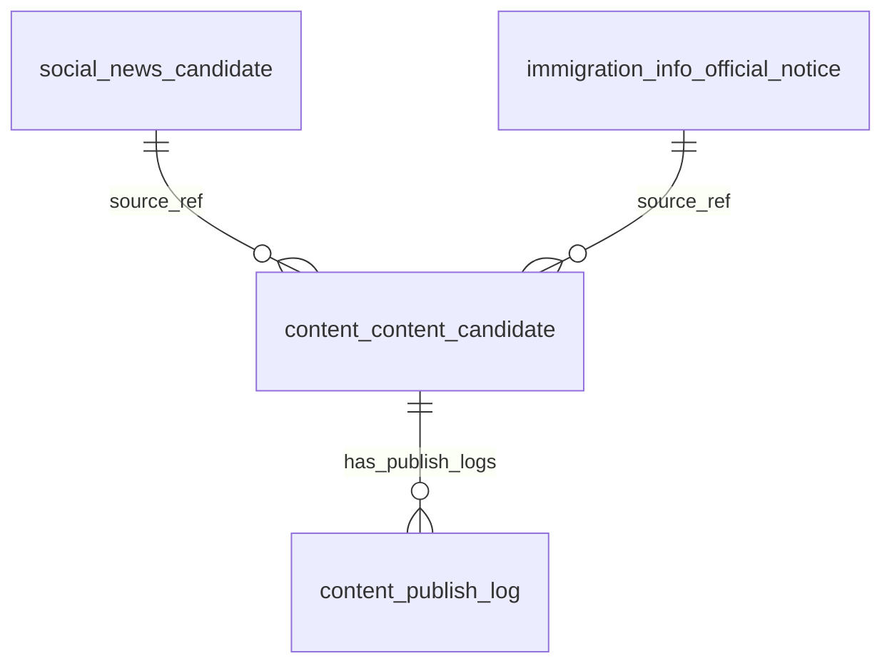

# Content Current DB Reference

## 1. Purpose

The `content` schema stores integrated publishable content candidates.

It is the bridge between collected source/domain data and external publishing channels such as Facebook.

The core concept is:

```text
domain/source candidate
→ content.content_candidate
→ content.publish_log
```

## 2. Current Role

The content schema is intended to become the final publishing hub.

Current source domains may include:

* social news
* immigration notice
* living information
* occupation information
* government notice
* visa information

At the current stage, the most important source appears to be:

```text
social_news.candidate
```

and possibly:

```text
immigration_info.official_notice
```

## 3. Key Tables

### 3.1 content_candidate

Purpose:

Stores final content candidates that can be published or reviewed.

This table should not be a blind copy of source tables.

It should contain content-publishing-specific fields such as:

* source domain
* content type
* category
* title
* summary
* why it matters
* link URL
* language
* priority group
* final publish score
* status
* source reference
* Facebook post URL if published
* published timestamp

Expected source reference fields:

```text
raw_ref_table
raw_ref_id
raw_payload
```

These fields connect content back to the source row.

### 3.2 publish_log

Purpose:

Stores final external publishing result for content candidates.

Expected fields:

* content candidate id
* channel
* request payload without secrets
* response payload
* status
* error code
* error message
* external post id
* published at
* dry-run flag

This table should become the authoritative publishing log.

## 4. Content Candidate Contract

A content candidate is not just a source row.

It should answer:

```text
Can this item be shown to foreign workers as useful, safe, understandable content?
```

Required conceptual fields:

```text
source_domain
content_type
category
title
summary_en
why_it_matters_en
link_url
source_name
status
score
raw_ref_table
raw_ref_id
created_at
updated_at
published_at
facebook_post_url
```

## 5. Current Logical ERD



Note:

`source_ref` may be logical through `raw_ref_table` and `raw_ref_id`, not physical FK.

## 6. Current Status Values to Check

Expected possible statuses:

```text
DRAFT
READY_TO_REVIEW
READY_TO_PUBLISH
POSTED
FAILED
SKIPPED
ARCHIVED
REVIEW_REQUIRED
REVIEW_REQUIRED_SENSITIVE
CONTENT_INVALID
CONTENT_INVALID_LINK
CONTENT_INVALID_LANGUAGE
```

Actual status values must be extracted from DB.

## 7. Current Relationship to Social News

Expected mapping:

| Source                     | Content                                   |
| -------------------------- | ----------------------------------------- |
| `social_news.candidate.id` | `content.content_candidate.raw_ref_id`    |
| `'social_news.candidate'`  | `content.content_candidate.raw_ref_table` |
| `SOCIAL_NEWS`              | `source_domain`                           |
| `NEWS_ARTICLE`             | `content_type`                            |

Important checks:

* Does one news candidate create only one content candidate?
* Are duplicate news rows copied into content candidates?
* Are posted social news rows missing content rows?
* Is Facebook post URL stored in content?
* Is source URL valid article URL or Google RSS/root URL?

## 8. Current Relationship to Immigration

Expected mapping:

| Source                                      | Content                                   |
| ------------------------------------------- | ----------------------------------------- |
| `immigration_info.official_notice.id`       | `content.content_candidate.raw_ref_id`    |
| `'immigration_info.official_notice'`        | `content.content_candidate.raw_ref_table` |
| `IMMIGRATION_INFO`                          | `source_domain`                           |
| `IMMIGRATION_NOTICE` or `GOVERNMENT_NOTICE` | `content_type`                            |

Official immigration content should usually be reviewed before automatic publishing.

## 9. Publishing Rule

Only `content.content_candidate` should be used for final Facebook publishing.

The final Facebook post should use:

```text
message = title + summary + why it matters + hashtags
link = link_url
```

Do not embed long URLs in message.

Do not use invalid links:

* Google RSS URLs
* publisher root URLs
* unresolved redirect URLs
* empty URLs

## 10. Current Problems to Verify

### 10.1 Content Candidate as Copy

Check whether `content_candidate` has its own final fields or only mirrors news candidates.

### 10.2 Publish Log Split

Check whether publish logs are split between:

```text
social_news.publish_log
content.publish_log
```

Define which one is authoritative.

### 10.3 Missing Facebook URL

Posted content candidates must have either:

* external post id
* Facebook post URL
* publish log reference

### 10.4 Date Confusion

Content UI should distinguish:

* original published date
* source collected date
* content created date
* content updated date
* Facebook published date

### 10.5 Unsafe Content

Content candidate should block publishing if:

* English post contains Korean
* message contains operation log text
* link URL is invalid
* sensitive event is unreviewed
* source relevance is too low

## 11. Risk Level

Risk level:

```text
HIGH
```

Safe changes:

* read-only reports
* UI label changes
* summary count queries
* non-destructive validation columns
* non-destructive indexes

Requires approval:

* changing publish selection logic
* enabling scheduler
* changing Facebook publish path
* deleting/archive bulk content
* mass sync from source tables
* changing status lifecycle
