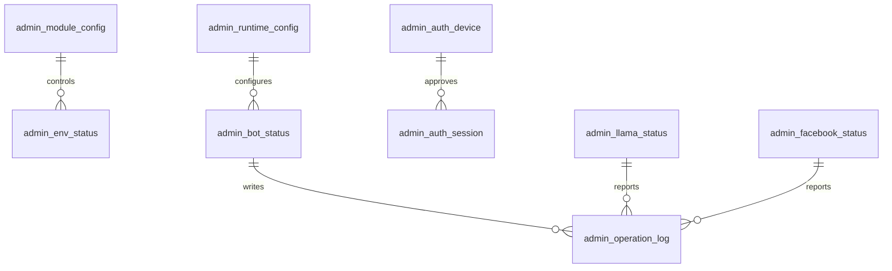

# 05_ADMIN_OPS_CURRENT.md

```md
# Admin and Operations Current DB Reference

## 1. Purpose

The admin/ops DB area supports WorkConnect internal operations.

It may include:

- admin access
- device approval
- module configuration
- runtime configuration
- bot status
- scheduler status
- environment readiness
- dashboard summary
- operation logs
- Facebook status
- local LLaMA status

This area is operationally sensitive.

## 2. Current Role

The admin UI uses this area to show and control system state.

Current operational areas include:

```text
dashboard
bot control
module toggle
Facebook status
LLaMA status
logs
admin access
scheduler/runtime config
````

## 3. Key Table Categories

Because table names may vary, this document describes table categories first.

### 3.1 Admin Auth / Access Tables

Purpose:

* admin login
* device approval
* session or token tracking
* Telegram-based approval if present

Risk:

Very high.

Breaking these tables can prevent admin login.

### 3.2 Module Config Tables

Purpose:

* control whether a collector/step/publisher/notifier is enabled
* reflect UI toggle state
* enforce backend execution rule

Important rule:

Frontend toggle is not enough.
Backend must also check module config before executing a module.

Example module keys:

```text
collector.naver
collector.google
collector.rss
step.normalize
step.summarize
step.duplicate_check
step.llama_check
step.candidate_evaluation
publish.facebook
notify.telegram
```

### 3.3 Runtime Config Tables

Purpose:

* dry-run default
* polling interval
* threshold
* keyword defaults
* publish interval
* dashboard refresh settings

Sensitive values should not be stored directly.

### 3.4 Env Status Tables

Purpose:

* track whether required environment variables are configured
* show readiness without exposing secret values

Examples:

```text
FACEBOOK_PAGE_ID
FACEBOOK_PAGE_ACCESS_TOKEN
TELEGRAM_BOT_TOKEN
LOCAL_LLAMA_ENDPOINT
```

Rule:

Never store raw secret values.

Only store readiness/status/fingerprint if needed.

### 3.5 Bot Status Tables

Purpose:

* show whether bots are active
* track last started/completed time
* current task
* last error
* processed count

Possible bots:

```text
social news bot
occupation bot
content publishing bot
living info bot
immigration bot
LLaMA helper
```

### 3.6 Operation Log Tables

Purpose:

* recent dashboard logs
* pipeline logs
* bot logs
* error logs
* publish logs if ops-level copy exists

Dashboard should read recent logs with limit.

It should not load all logs.

### 3.7 LLaMA Status Tables

Purpose:

* local LLaMA availability
* model name
* endpoint
* connection status
* manual off flag
* last error

Important distinction:

```text
auto use off
model unloaded
Ollama server stopped
endpoint disconnected
```

These are different states.

### 3.8 Facebook Status Tables

Purpose:

* page id readiness
* token validity summary
* permission status
* token fingerprint
* last check time
* last publish error

Rule:

Do not store raw access token.

## 4. Current Logical ERD



Note:

This is a conceptual ERD.
Actual table names and FK constraints must be verified from DDL.

## 5. Current Dashboard Rule

Dashboard must be a status board.

It should show:

* counts
* current status
* recent logs
* bot activity
* LLaMA readiness
* Facebook readiness

Dashboard must not:

* load all news candidates
* load all content candidates
* load all logs
* count rows in frontend
* create duplicate polling intervals

## 6. Current API Expectations

Operational APIs should be lightweight.

Expected examples:

```http
GET /api/admin/dashboard/summary
GET /api/admin/bots/status
GET /api/admin/logs/recent?limit=20
GET /api/admin/llama/status
GET /api/admin/facebook/status
GET /api/admin/modules
PATCH /api/admin/modules/{id}
```

## 7. Current Problems to Verify

### 7.1 Server Status False Negative

Check whether frontend treats `204 No Content` or failed optional status calls as full server disconnect.

### 7.2 Polling Duplication

Check whether route changes create multiple polling intervals.

### 7.3 Dashboard Heavy Query

Check whether dashboard summary calls load full source tables.

### 7.4 Auth Breakage

Check whether recent changes affected:

* localStorage/sessionStorage keys
* X-Device-Id
* admin secret headers
* approval status
* CORS preflight handling

### 7.5 Bot Flag Stuck State

Check whether deadlock or failed cycle turns bot status permanently off.

### 7.6 Token Validation Misclassification

Check whether soon-expiring but valid Facebook tokens are marked invalid.

### 7.7 LLaMA State Confusion

Check whether OFF means:

* manual off
* disconnected
* model unloaded
* server stopped

These should be separated.

## 8. Protection Rule

The admin/ops area is a protected area.

Without explicit user approval, do not change:

* admin auth
* device approval
* Facebook token validation
* Facebook publisher
* scheduler
* bot ON/OFF state logic
* LLaMA server kill behavior
* destructive migration
* environment secret handling

## 9. Safe Changes

Safe changes:

* read-only documentation
* dashboard label clarification
* recent log limit
* summary query optimization
* polling cleanup if isolated
* status display mapping
* non-destructive indexes

## 10. Risk Level

Risk level:

```text
HIGH
```

Reason:

This area controls whether the admin UI, bots, and publishing system can operate.

````